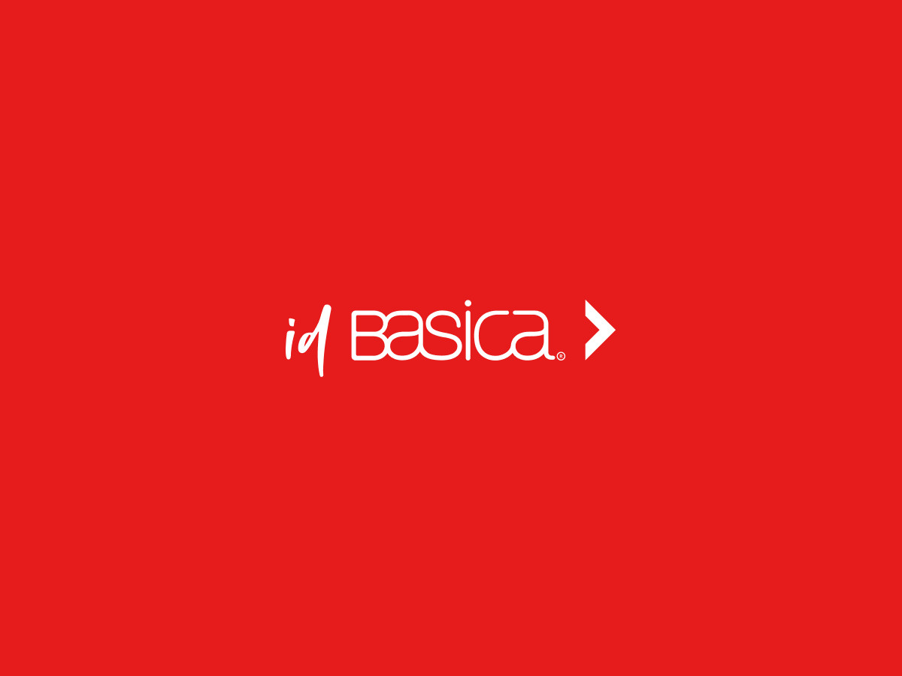

# ID Basica

A custom intranet dashboard designed for HR management and employee self-service, streamlining internal processes and enhancing team collaboration.



## Features

### HR Administrator Guide

The HR administrator dashboard provides access to:
- Employee management
- Leave approval workflow
- Document management
- Company announcements

### Employee Portal Guide

The employee self-service portal allows team members to:
- View and update personal information
- Request and track leave
- Access company documents
- View company announcements

## Development

### Features

- Modern WordPress architecture
- Advanced Custom Fields integration
- SCSS for streamlined styling
- JavaScript bundling with Webpack
- Responsive design for desktop and mobile access
- Code quality tools (PHP_CodeSniffer, ESLint, Stylelint)

### Structure

```
acf-json/      # ACF JSON files for data structures
assets/        # Compiled CSS and JavaScript files
inc/           # PHP includes and functionality
├── acf/       # ACF related functionality
└── classes/   # PHP classes for business logic
src/           # Source files
├── js/        # JavaScript source files
└── scss/      # SCSS source files
```

### User Documentation

For detailed user documentation, please see the [User Guide](docs/user-guide.md).

### SASS Development

This theme uses a modern SASS architecture with the following features:

- Uses the 7-1 pattern for SCSS organization
- Leverages `@use` instead of deprecated `@import` for module management
- Requires proper namespacing when using imported modules (e.g., `mx.breakpoint-up`)
- Custom mixins for handling CSS variables with color functions (see `abstracts/_mixins.scss`)

When working with SCSS files:
1. Import modules with namespaces: `@use '../abstracts/mixins' as mx;`
2. Use the namespace when calling mixins: `@include mx.breakpoint-up('md')`
3. For color operations on CSS variables, use the custom mixins: `@include mx.color-darken(property, var-name, amount)`

### Changelog

Please see [CHANGELOG.md](CHANGELOG.md) for more information on recent changes.
